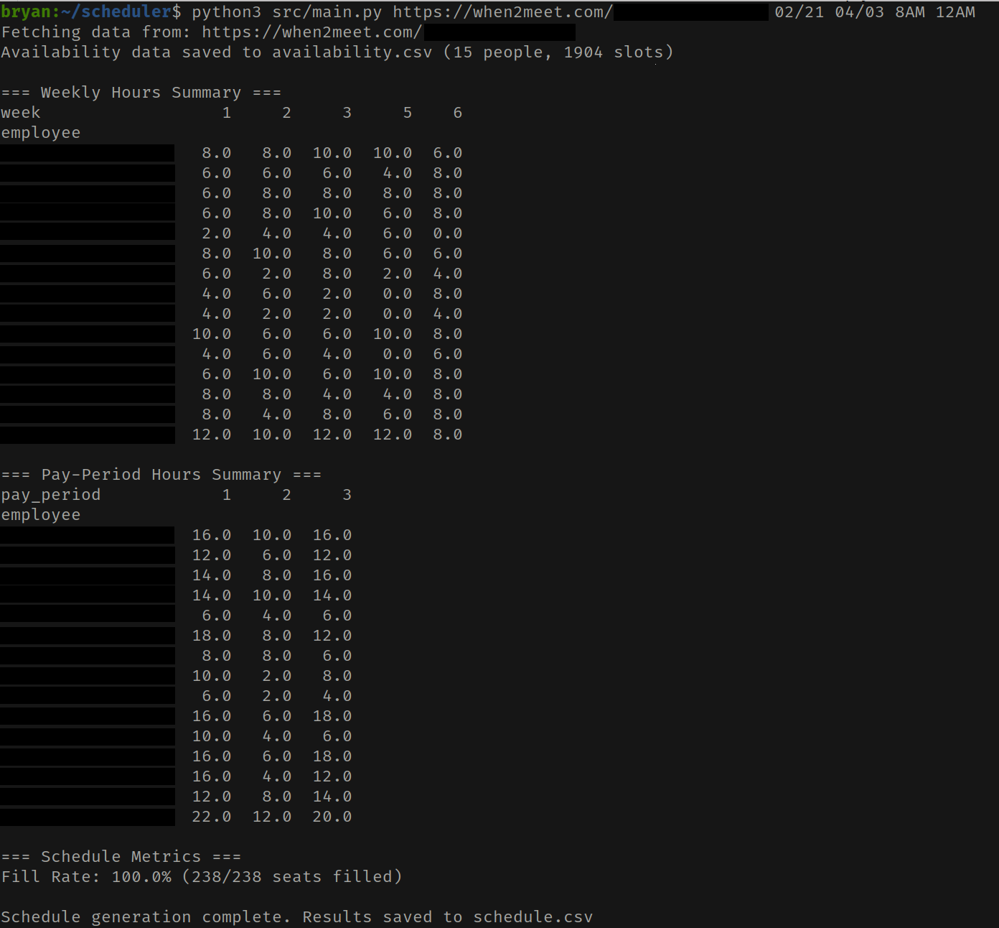

<div align="center">

# When2Meet Analyzer

_A deterministic, constraint-aware scheduling engine designed for optimized staff management._

[](#)
[](#)
[](#)

</div>

## Overview

Scheduling employees is often a manual, error and bias-prone task complicated by erratic availability and role-based constraints. When2Meet Analyzer automates this by scraping internal When2Meet JavaScript and applying a weighted heuristic algorithm to generate optimized schedules. It handles complex shift and time requirements with 100% determinism and accuracy.

## Key Features

- **Dynamic State Extraction:** Bypasses standard DOM limitations by parsing internal JavaScript via high-performance RegEx patterns, ensuring access to the raw data required for precise scheduling.
- **Temporal Gap Integrity:** Maps shifts directly to extracted dates and times. This allows the tool to handle calendar gaps like breaks.
- **Weighted Heuristic Engine:** Employs a multi-factor scoring function to balance role-based caps, fairness & diversity, and employee preferences.
- **Fully Configurable**: Fine-tune the algorithm by adjusting role-based hour caps, shift capacities, and weighted scoring parameters.

## Performance & Benchmarks

- **100% Fill Rate:** Consistently achieves perfect coverage across complex 40+ day periods with high staff contention.
- **Sub-Second Execution:** Processes 2,000+ availability slots and generates full CSV schedule reports of in ~650ms on average.

## Tech Stack

| Category             | Technologies   |
| -------------------- | -------------- |
| **Logic/Engine**     | Python, Pandas |
| **Data Engineering** | RegEx, CSV     |
| **Config**           | JSON           |

## Images

#### Schedule Report



## Installation & Setup

1. Clone the repository with `git clone https://github.com/BryanWieschenberg/When2Meet-Analyzer.git`, enter the directory with `cd When2Meet-Analyzer`, and install dependencies with `pip install -r requirements.txt`
2. Configure in `config.json` with your desired constraints and employee settings. Consult [docs/config.md](/docs/config.md) for details on each property
3. Run the main script:

```bash
python3 src/main.py <url_or_id> <start_date> <end_date> <start_hour> <end_hour> <exceptions>?
```

**Example:**

```bash
python3 src/main.py 78460395-QrTnA 02/21 04/03 08AM 12AM [Bryan]
```
